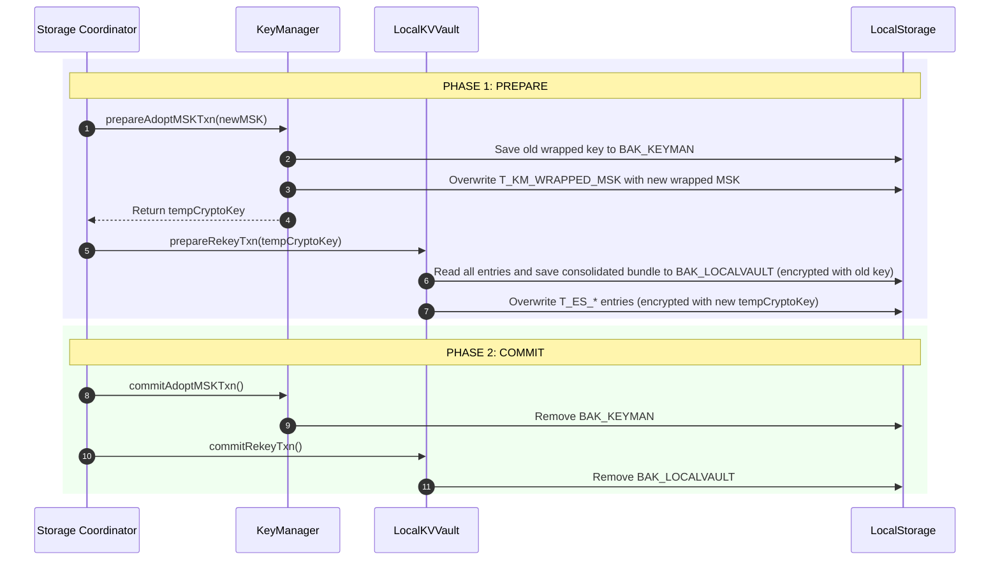

# Two-Phase Commit (2PC) Protocol for Master Secret Key (MSK) Adoption

Trezur utilizes a coordinated **Two-Phase Commit (2PC)** protocol to guarantee transactional safety and data integrity when adopting a new Master Secret Key (MSK) or rekeying the local vault.

Since Trezur stores cryptographic parameters in the key manager namespace (`T_KM_*`) and the actual token data in the encrypted vault namespace (`T_ES_*`), a key rotation or replacement operation spans multiple logical storage layers. If the app or device crashes midway through this operation, we must guarantee that the vault does not end up in an unrecoverable "split-brain" state (e.g., where the vault is encrypted under the new key but the key manager is still expecting the old key, or vice-versa).

---

## 1. Protocol Architecture & Symmetrical Interface

The transaction is orchestrated by a **Coordinator** (the storage module) and executed by two **Participants**:

1. **Coordinator**: `src/lib/state/storage.svelte.js`
2. **KeyManager Participant**: `src/lib/state/key-manager.svelte.js`
3. **LocalKVVault Participant**: `src/lib/utils/local-kv-vault.js`

To enforce a uniform and safe transactional sequence, both participants implement a symmetrical three-method interface:

| Phase           | KeyManager Method            | LocalKVVault Method             | Description                                                                                                                   |
| :-------------- | :--------------------------- | :------------------------------ | :---------------------------------------------------------------------------------------------------------------------------- |
| **1. Prepare**  | `prepareAdoptMSKTxn(newMSK)` | `prepareRekeyTxn(newCryptoKey)` | Writes temporary journal backups to persistent storage and stages the key changes _without_ destroying the ability to revert. |
| **2. Commit**   | `commitAdoptMSKTxn()`        | `commitRekeyTxn()`              | Deletes backup journals, finalizing the new key material as permanent.                                                        |
| **3. Rollback** | `rollbackAdoptMSKTxn()`      | `rollbackRekeyTxn()`            | Restores the original key material from journal backups and discards staged changes.                                          |

---

## 2. The Coordinated Adoption Flow (`adoptMSK`)

Below is the sequence of operations executed during `adoptMSK(newMSK)`:

### Unhandled Runtime Errors

If any step in the `try` block of the coordinator throws an error, the coordinator immediately transitions into the **Rollback Phase**:

1. Calls `localVault.rollbackRekeyTxn()` to restore `T_ES_*` from `BAK_LOCALVAULT` using the old key.
2. Calls `keyManager.rollbackAdoptMSKTxn()` to restore the old MSK from `BAK_KEYMAN`.
3. Re-throws the error to the UI layer.

---

## 3. Crash Recovery Matrix (`initStorage`)

When Trezur starts up, the storage module checks for interrupted transactions during `initStorage()`. Rather than using complex state flags in `localStorage`, the coordinator uses the presence of the transaction journals themselves as the single source of truth.

To preserve proper component encapsulation, the coordinator never directly accesses `BAK_KEYMAN` in `localStorage`. Instead, it queries the key manager using the `keyManager.hasBackup` getter.

The presence of the KeyManager backup journal (`backupMSK`) on boot acts as the coordinator's indicator:

- **`keyManager.hasBackup` is true**: KeyManager did not commit. We must roll back both participants.
- **`keyManager.hasBackup` is false**: KeyManager committed successfully. We must roll forward both participants.

Because participant actions are **fully idempotent**, the recovery protocol behaves predictably and safely across all crash configurations:

### Scenario A: Crash _during_ KeyManager Preparation

- **Journal State**: `BAK_KEYMAN` exists (or is half-written). `BAK_LOCALVAULT` does not exist. Primary keys are still encrypted under the **old** key.
- **Recovery Actions on Boot**:
  1. `initStorage()` detects `keyManager.hasBackup` is true.
  2. Calls `keyManager.rollbackAdoptMSKTxn()` $\rightarrow$ Restores `T_KM_*` parameters from the backup and removes `BAK_KEYMAN`.
  3. `keyManager.unlock()` successfully derives the **old** `cryptoKey`.
  4. `localVault` is created with the **old** key.
  5. Coordinator calls `localVault.rollbackRekeyTxn()`.
  6. `rollbackRekeyTxn()` detects `BAK_LOCALVAULT` is missing $\rightarrow$ Safely returns without modifying storage.
- **Outcome**: The app successfully unlocks under the old key. No data is lost.

### Scenario B: Crash _during_ Vault Preparation

- **Journal State**: `BAK_KEYMAN` exists. `BAK_LOCALVAULT` exists. Primary vault entries in `localStorage` are in a hybrid state (some under the old key, some under the new key).
- **Recovery Actions on Boot**:
  1. `initStorage()` detects `keyManager.hasBackup` is true.
  2. Calls `keyManager.rollbackAdoptMSKTxn()` $\rightarrow$ Restores the old wrapped MSK and removes `BAK_KEYMAN`.
  3. `keyManager.unlock()` successfully derives the **old** `cryptoKey`.
  4. `localVault` is created with the **old** key.
  5. Coordinator calls `localVault.rollbackRekeyTxn().`
  6. `localVault.rollbackRekeyTxn()` reads `BAK_LOCALVAULT`, decrypts the bundle using the **old** key, overwrites all active `T_ES_*` keys with the restored values, and removes the journal.
- **Outcome**: Staged changes are cleanly rolled back. The app successfully unlocks under the old key. No data is lost.

### Scenario C: Crash _after_ KeyManager Commit but _before_ Vault Commit

- **Journal State**: `BAK_KEYMAN` is deleted. `BAK_LOCALVAULT` exists. Primary vault entries are all encrypted under the **new** key.
- **Recovery Actions on Boot**:
  1. `initStorage()` detects `keyManager.hasBackup` is false.
  2. `keyManager.unlock()` successfully derives the **new** `cryptoKey`.
  3. `localVault` is created with the **new** key.
  4. Coordinator enters the `else` commit block and calls `localVault.commitRekeyTxn()`.
  5. `localVault.commitRekeyTxn()` transitions the in-memory keys and purges `BAK_LOCALVAULT`.
- **Outcome**: The transaction is successfully rolled forward. The app unlocks under the new key. No data is lost.

### Scenario D: Crash _during_ Commit Cleanup

- **Journal State**: `BAK_KEYMAN` is deleted. `BAK_LOCALVAULT` is deleted (or half-deleted).
- **Recovery Actions on Boot**:
  1. `initStorage()` detects `keyManager.hasBackup` is false.
  2. `keyManager.unlock()` successfully derives the **new** `cryptoKey`.
  3. `localVault` is created with the **new** key.
  4. Coordinator enters the `else` commit block and calls `localVault.commitRekeyTxn()`.
  5. `localVault.commitRekeyTxn()` detects `BAK_LOCALVAULT` is already missing $\rightarrow$ Safely returns without modifying storage.
- **Outcome**: The app successfully unlocks under the new key. No data is lost.

---

## 4. Key Design Decisions

### Removal of Stage Flags

Earlier iterations of the storage coordinator wrote and removed a `'T_STORAGE_REKEY_STAGE'` flag in `localStorage` to track transition steps.

During the verification phase, this was determined to be redundant and was removed. Because the participants are **idempotent** and the presence of `BAK_KEYMAN` provides an unambiguous, binary signal of whether KeyManager committed, staging flags only added overhead and potential points of desynchronization. Relying purely on the journals themselves ensures that the file-system state itself serves as the single source of truth.
